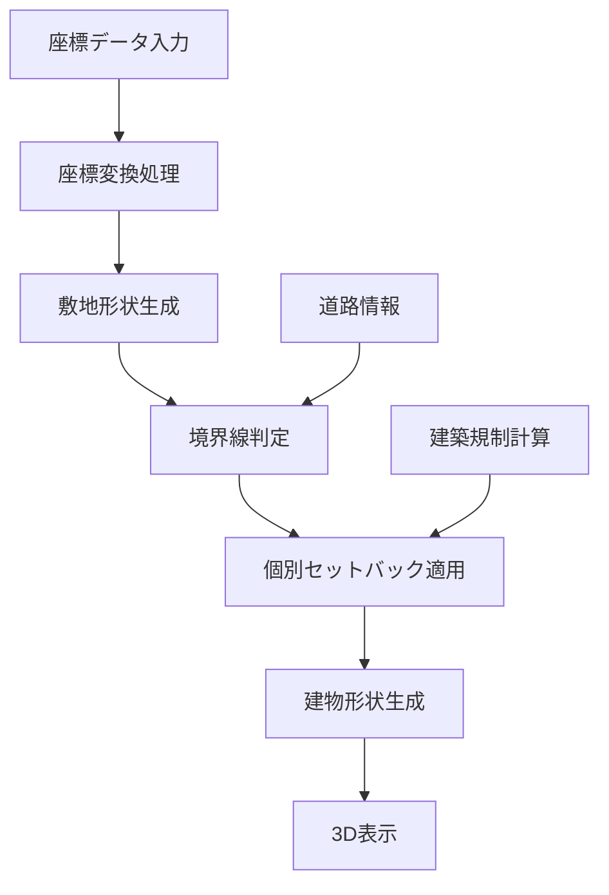

# Phase 2 実装ロードマップ

## 1. エラー発生関連ファイルと依存関係

### 1.1 コアファイル群

#### バックエンド
```
backend/src/features/analysis/
├── utils/
│   ├── buildingShapeGenerator.ts    # [核心] 建物形状生成ロジック
│   ├── boundaryAnalyzer.ts          # [新規] 境界線判定機能
│   └── testBoundaryData.ts          # [新規] テストデータセット
├── analysis.utils.ts                # ボリュームチェック統合
└── regulation/                      # 建築規制計算（既存）
```

#### フロントエンド
```
frontend/src/features/
├── analysis/
│   ├── utils/
│   │   └── buildingShapeGenerator.ts  # バックエンドと同期必要
│   └── components/
│       └── ThreeViewer/
│           └── BuildingModel.tsx      # 3D表示（自動対応）
└── properties/
    └── components/
        └── CoordinateInput/           # 座標入力（完成済み）
```

#### 共通定義
```
shared/index.ts                        # 型定義・APIパス
backend/src/types/index.ts            # バックエンド用コピー
```

### 1.2 依存関係フロー



## 2. 実装ステップとログ設置計画

### Step 1: 型定義の拡張とログ基盤（Day 1）✅

```typescript
// shared/index.ts に追加
export enum SetbackReason {
  ROAD_SETBACK = "道路境界線",
  NEIGHBOR_SETBACK = "隣地境界線",
  SLOPE_RESTRICTION = "斜線制限",
  SHADOW_REGULATION = "日影規制",
  DISTRICT_PLAN = "地区計画"
}

// ログポイント設置
const logger = {
  boundary: (msg: string, data?: any) => console.log(`[BOUNDARY] ${msg}`, data),
  shape: (msg: string, data?: any) => console.log(`[SHAPE] ${msg}`, data),
  error: (msg: string, error?: any) => console.error(`[ERROR] ${msg}`, error)
};

// ✅ 実装完了:
// - shared/index.ts にSetbackReason列挙型追加
// - backend/src/types/index.ts に同期
// - SetbackInfo, FloorInfo, BuildingShape型追加
// - buildingShapeGenerator.ts にログ基盤追加
```

### Step 2: 境界線判定機能（Day 2-3）

#### 2.1 boundaryAnalyzer.ts の新規作成
```typescript
export function analyzeBoundaries(
  points: BoundaryPoint[],
  roadWidth?: number,
  roadDirection?: number
): BoundaryAnalysisResult {
  logger.boundary('開始', { 
    pointCount: points.length, 
    roadWidth, 
    roadDirection 
  });
  
  try {
    // 1. 各辺の長さと方位を計算
    const segments = calculateSegments(points);
    logger.boundary('セグメント計算完了', segments);
    
    // 2. 道路側の判定
    const roadSegments = detectRoadSegments(segments, roadWidth);
    logger.boundary('道路側判定完了', roadSegments);
    
    // 3. 結果を返す
    return { segments, roadSegments, neighborSegments };
  } catch (error) {
    logger.error('境界線判定エラー', error);
    throw error;
  }
}
```

#### 2.2 エラー検知ポイント
- 座標データの妥当性チェック
- 自己交差ポリゴンの検出
- 道路判定の失敗ケース

### Step 3: 不等間隔オフセット実装（Day 4-6）

#### 3.1 clipper-lib の統合
```bash
npm install clipper-lib @turf/turf
```

#### 3.2 buildingShapeGenerator.ts の拡張
```typescript
export function generateAdvancedBuildingShape(
  siteShape: BoundaryPoint[],
  boundaryAnalysis: BoundaryAnalysisResult,
  buildingParams: BuildingParameters
): BuildingShape {
  logger.shape('詳細形状生成開始', {
    sitePoints: siteShape.length,
    roadSegments: boundaryAnalysis.roadSegments
  });
  
  const floors: FloorInfo[] = [];
  let currentShape = siteShape;
  
  for (let i = 0; i < requiredFloors; i++) {
    logger.shape(`${i+1}階の生成開始`);
    
    // 階層別セットバック計算
    const setbacks = calculateFloorSetbacks(
      i, 
      boundaryAnalysis,
      regulations
    );
    
    // 不等間隔オフセット適用
    currentShape = applyVariableOffset(
      currentShape,
      setbacks,
      boundaryAnalysis
    );
    
    logger.shape(`${i+1}階の生成完了`, {
      area: calculateArea(currentShape),
      setbacks
    });
    
    floors.push({
      level: i + 1,
      shape: currentShape,
      area: calculateArea(currentShape)
    });
  }
  
  return { floors, totalHeight, buildingArea };
}
```

### Step 4: フロントエンド同期（Day 7）

#### 4.1 バックエンドロジックの移植
- buildingShapeGenerator.ts の完全同期
- 同じライブラリの使用（clipper-lib）

#### 4.2 3D表示の確認
- BuildingModel.tsx は自動対応
- セットバック理由の可視化追加

### Step 5: 統合テスト（Day 8）

#### 5.1 テストシナリオ
1. 単純な矩形敷地
2. L字型敷地
3. 角地（2方向道路）
4. 旗竿地
5. 不整形地（14点ポリゴン）

#### 5.2 検証ポイント
- 境界線判定の精度
- セットバック距離の正確性
- 3D表示の整合性
- パフォーマンス（1秒以内）

## 3. エラー対応フロー

### 3.1 環境差異の確認
```bash
# ローカル環境変数
echo $NODE_ENV
echo $MONGODB_URI

# 本番環境変数（Cloud Run）
gcloud run services describe hinago-backend \
  --platform managed \
  --region asia-northeast1 \
  --format="yaml(spec.template.spec.containers[0].env)"
```

### 3.2 エラー発生時の対応
1. ログ出力から問題ステップを特定
2. 該当ステップのみにフォーカス
3. 単体テストで問題を再現
4. 修正後、統合テストで確認

## 4. 完了基準

### Phase 2 完了条件
- [ ] 境界線の自動判定が70%以上の精度
- [ ] 道路側4m、隣地側0.5mのセットバック適用
- [ ] 不整形地での正常動作
- [ ] 既存機能への影響なし
- [ ] パフォーマンス基準達成

### ドキュメント更新
- [ ] API仕様書の更新
- [ ] 実装詳細ドキュメント
- [ ] テスト結果レポート

---

**最終更新**: 2025-06-03
**ステータス**: Day 1完了 / Day 2-3実装中